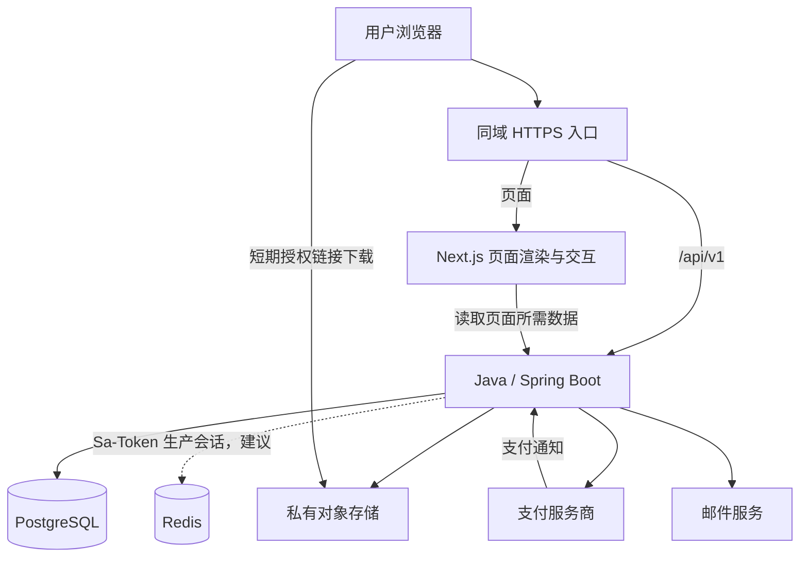

# AriesHub 项目文档

版本：v0.5

日期：2026-09-28

状态：已实现落地页、PostgreSQL 驱动的案例浏览、基于 Resend 和 Redis 的邮箱验证码身份流程，以及管理员案例编辑、发布和下架。交易与资源交付按后续阶段接入。

## 1. 项目背景与目标

运营者在工作之外持续学习 Codex 和 AI 工具，制作真实作品，通过小红书等自媒体展示成果，将感兴趣的用户引导至自己的平台。平台承接案例浏览、数字产品购买、在线阅读与文件下载，减少逐单沟通和人工交付。

长期希望形成有真实用户和内容积累的社区，同时作为能够展示产品设计、Java 工程能力、上线运维和用户反馈迭代的求职作品。

### 1.1 产品定位

**一个以可复现的 AI 实战案例为核心、支持数字资源自动交付的平台。**

首批目标用户暂定为：希望借助 AI 完成具体作品、但缺少完整步骤和示例材料的个人。早期按具体案例验证需求，不先覆盖所有 AI 人群。

内容可以包括 AI PPT 工作流程、Codex 小工具、网页项目、素材整理等。出售的是原创或具备分发授权的案例、模板、源码和教程；不纳入接码、账号交易等业务。

### 1.2 首版目标

1. 访客能看懂案例解决的问题、效果、使用条件和交付内容。
2. 用户能完成单个案例包的购买，并自助取得阅读和下载权限。
3. 运营者能独立发布、更新和下架案例，查询订单并处理异常。
4. 公开案例页面可分享，适合承接自媒体流量。
5. 核心流程有测试、日志和部署说明，可用于真实运营及项目展示。

### 1.3 业务原则

- 首版以单次购买为主，不预设年费会员或无限答疑。
- 自动交付是主流程；退款、支付异常、文件问题仍需人工处理入口。
- 商品页说明工具费用、适用版本、基础要求、授权范围和支持范围。
- 不承诺买完必然赚钱，也不把演示成功当成所有用户都能复现的保证。
- 开发以完整用户流程为单位，每个阶段都应能演示和验证。

## 2. 首版范围与后续范围

这里的“首版”指达到真实付费运营条件的版本；前几个里程碑可以只在本地或测试环境验收。

| 功能 | 首版 | 后续考虑 |
| --- | --- | --- |
| 首页、案例列表、分类、关键词检索 | 是，使用数据库查询 | 更复杂的推荐与搜索 |
| 案例详情、成品展示、免费预览 | 是 | 多章节学习体验 |
| 免费内容、付费正文、资源下载 | 是 | 专栏、套餐 |
| 账号、登录、密码找回 | 是 | 第三方登录 |
| 单案例订单、单一支付渠道 | 是 | 优惠券、多渠道 |
| 已购案例、订单查询 | 是 | 学习进度、收藏 |
| 后台发布、资源更新、订单处理 | 是 | 多运营者协作 |
| 用户提问、评论、作品分享 | 否 | 有真实互动需求后加入 |
| 会员订阅、积分、排行榜、私信 | 否 | 需求验证后逐项评估 |
| 在线生成 PPT 或调用 AI 模型 | 否 | 作为独立服务评估成本 |
| 创作者入驻、分佣、多商户结算 | 否 | 暂无规划 |

## 3. 角色与核心流程

### 3.1 角色

| 角色 | 能力 |
| --- | --- |
| 访客 | 浏览已发布案例、查看免费内容与预览、注册登录 |
| 普通用户 | 访客能力，以及创建订单、查看本人订单和已购案例 |
| 有效权益用户 | 阅读对应付费正文、下载对应资源 |
| 管理员 | 内容与资源管理、订单查询、异常处理、查看基础统计 |

“已购买”是用户与案例之间的权益关系，不是用户的全局角色。购买 A 不得获得 B 的权限。

### 3.2 用户流程

自媒体内容 → 案例详情 → 查看效果及交付清单 → 注册或登录 → 创建订单 → 支付 → 后端确认付款并开通权益 → 在线阅读或下载 → 在“我的案例”再次访问。

免费案例不需要创建零元订单；免费正文可公开阅读，免费资源默认登录后下载，具体限制显示在页面上。

### 3.3 运营流程

制作并验证案例 → 建立草稿 → 填写公开介绍与付费内容 → 上传资源 → 检查预览和下载 → 发布 → 分发对应视频 → 根据访问、购买和使用反馈更新。

### 3.4 异常流程

- 支付后页面关闭：用户重新登录，通过订单和权益状态继续获取内容。
- 支付回调重复或延迟：重复通知不重复发货；定时查单补偿未及时确认的订单。
- 文件下载失败：重新申请短期下载链接；仍失败时显示问题反馈入口。
- 商品下架：停止新购买；默认保留已有购买者的交付访问。
- 内容必须停止提供：管理员单独执行暂停交付，填写原因，关联受影响订单进行处理；不与普通下架混用。
- 退款成功：撤销该订单产生的权益；其他独立有效权益不受影响。已下载到用户本地的文件无法远程收回。

## 4. 页面设计清单

| 页面 | 建议路径 | 主要内容 |
| --- | --- | --- |
| 首页 | `/` | 平台说明、精选案例、分类入口 |
| 案例列表 | `/cases` | 关键词、分类、免费或付费筛选、分页 |
| 案例详情 | `/cases/[slug]` | 成品效果、适用人群、预览、价格、交付清单、购买或阅读入口 |
| 案例阅读 | `/learn/[caseId]` | 可访问正文、资源版本、下载、常见问题 |
| 注册与登录 | `/register`、`/login` | 注册需邮箱验证码；登录需邮箱和密码；显示验证与限流提示 |
| 内容后台 | `/admin`、`/admin/cases/[id]` | 案例草稿、正文编辑、发布和下架 |
| 密码找回 | `/forgot-password` | 请求重置邮件、设置新密码 |
| 确认订单 | `/checkout/[caseId]` | 商品快照、实付金额、交付及支持范围 |
| 订单详情 | `/orders/[orderNo]` | 付款入口、真实支付状态、交付入口 |
| 我的案例 | `/me/cases` | 有效权益对应的案例 |
| 我的订单 | `/me/orders` | 本人订单列表、状态、异常反馈 |
| 后台 | `/admin` | 基础统计与待处理事项 |
| 案例管理 | `/admin/cases` | 草稿、编辑、预览、发布、下架、资源管理 |
| 订单管理 | `/admin/orders` | 查询、支付记录、退款处理记录 |
| 帮助与规则 | `/help` | 下载帮助、授权说明、支持方式、隐私和交易规则 |

页面需要覆盖加载中、空数据、失败、未登录、无权限、已购买和移动端状态。购买前返回原页面，不能登录后丢失原始意图。

视觉方向暂定为简洁的内容与作品展示风格：突出成品截图、具体用途和交付内容。首版不制作空的社区动态和虚构用户评价。

## 5. 内容与商品模型

首版采用“一篇案例对应一个可购买产品”的简化模型，一个订单只购买一个案例，不实现购物车。

每个案例至少包含：

| 信息 | 要求 |
| --- | --- |
| 基本信息 | 标题、稳定 slug、摘要、封面、分类 |
| 效果展示 | 截图或演示链接，描述真实结果 |
| 使用条件 | 适用人群、所需基础、工具及额外费用 |
| 免费部分 | 介绍、部分步骤或示例，购买前可看 |
| 完整正文 | 免费案例公开；付费案例在授权后返回 |
| 交付资源 | 文件名称、类型、大小、版本、更新说明 |
| 售卖信息 | 免费或付费、当前价格、交付清单 |
| 服务说明 | 文件授权、支持方式、更新范围、退款规则 |
| 维护信息 | 最近验证日期、所用工具版本、已知限制 |

首版后台以 Markdown 编辑正文、独立上传图片和附件。禁用原始 HTML 或严格清洗渲染结果；不执行运营内容中的任意 MDX/JavaScript。

默认购买后可访问同一案例后续发布的内容和资源，但不承诺固定更新频率。商品变成另一种交付内容时应新建案例，避免改写历史承诺。订单保存购买时的商品及条款摘要。

## 6. 技术架构

### 6.1 已确定与建议

| 项目 | 方案 | 状态与原因 |
| --- | --- | --- |
| 后端语言 | Java | 已确定，便于运营者审查和维护 |
| 前端框架 | Next.js | 已确定 |
| Java 基线 | Java 27 | 沿用现有配置；已通过真实 PostgreSQL 集成测试 |
| 后端框架 | Spring Boot 4.1.1 / Spring MVC | 已接入 MVC 与 Bean Validation |
| 认证与授权 | Sa-Token 1.46.0 | 已接入 Boot 4 starter，使用 HttpOnly Cookie 和路由拦截器 |
| 后端构建 | Maven Wrapper | 已在 backend 初始化 |
| 前端 | Next.js 16.3.6、React 19.2.8、TypeScript、App Router | 已初始化，使用 npm 与 package-lock.json |
| 样式 | Tailwind CSS 4 + 全局样式变量 | 已初始化；组件库待实际需求出现后选择 |
| 数据库 | PostgreSQL | 已配置数据源与迁移，复用本机 5432 实例中的独立 `arieshub` 数据库 |
| 数据访问 | MyBatis-Plus 3.5.17 + Flyway | 已接入，简单查询使用 Lambda Wrapper，联表及敏感投影使用 XML |
| 样板代码 | Lombok 1.18.48 | 已接入并验证 Java 27，生成访问器、构造器与日志字段 |
| 后端结构 | 按业务模块划分的 DDD 四层 | 已应用于 catalog，详见后端架构文档 |
| API 契约 | REST + OpenAPI 3.1 | 已提供公开查询契约，并生成前端类型；变更需同步契约与实现 |
| 文件 | 私有对象存储，封面等公开资源单独管理 | 建议，下载需要授权 |
| 本地运行与部署 | 本机 PostgreSQL + Maven + npm | 开发环境已运行，完整生产部署待实现 |
| 会话存储 | 开发用 Sa-Token 内存实现；生产建议 Redis | 注册、登录和退出已验证；Redis 不替代 PostgreSQL 业务数据库 |
| 消息队列、搜索集群 | 首版不引入 | 暂无必要复杂度 |

现有版本以 `backend/pom.xml` 与 `frontend/package-lock.json` 为准。前端本次使用 Node.js 26.5.0、npm 11.17.0 初始化；新环境用 `npm ci` 恢复依赖。不要因为文档中记录了版本就跳过兼容性验证。

后端现已包含案例目录和身份用例、MyBatis-Plus、Flyway、PostgreSQL 数据源、Lombok、Sa-Token 和集成测试。Java 27 搭配 Lombok 1.18.48 已通过构建验证；领域对象不依赖 Web 或 ORM。

### 6.2 Java 与 Next.js 的职责



Java 是业务事实的唯一来源：账号、权限、价格、订单、支付确认、退款和下载授权都由 Java 判断。Next.js 不直接访问业务数据库，不维护另一套订单或登录体系。

Next.js 的页面布局和公开内容优先使用服务端组件；搜索交互、表单和支付状态轮询等按需使用客户端组件。服务端组件和客户端组件的边界参考 [Next.js 官方说明](https://nextjs.org/docs/app/getting-started/server-and-client-components)。

服务端渲染也不等于自动安全：付费正文只能在 Java 验证权限后返回，禁止先把完整内容发给浏览器再隐藏。

### 6.3 Sa-Token 认证、授权与缓存

本节记录已实现的认证方案和上线前仍需完成的安全工作。

- 登录方式为邮箱和密码；注册仍使用一次性邮箱验证码。用户及 BCrypt 密码摘要保存在 PostgreSQL。验证码由 Resend 投递，摘要、有效期、冷却期和失败次数保存在 Redis；登录、注册和发码限流也由 Redis 共享计数，找回密码尚未实现。
- 登录接口先校验密码与账号状态，再使用 `StpUtil.login(userId)` 创建登录态；退出调用 `StpUtil.logout()`。密码哈希使用独立的成熟 BCrypt 或 Argon2 实现，Sa-Token 登录态管理不代替密码校验。
- 使用 `SaInterceptor` 统一保护个人及后台 API；公开案例接口和支付通知明确列入放行规则，支付通知独立验签。角色和操作权限由 `StpInterface` 提供，通过 `StpUtil` 或鉴权注解校验。
- 用户 ID 只从 Java 验证后的登录态取得。管理员角色和 `case:write`、`order:read` 等权限控制运营操作；付费内容仍按 PostgreSQL 中的有效权益逐案例判断，不能用“已登录”或一个全局 VIP 角色替代。
- 未登录返回 HTTP 401，已登录但缺少权限返回 HTTP 403；资源不可用和业务状态异常使用独立错误码。接口不重定向为 HTML 登录页面。
- 浏览器默认使用后端设置的 `arieshub_token` Cookie，明确配置 `HttpOnly`、生产 `Secure`、`SameSite=Lax`、`Path=/`；Cookie 不指定跨子域 Domain。开发 HTTP 环境单独关闭 Secure，生产必须启用。
- 只开启约定的 Cookie 令牌读取方式，关闭从请求参数等非必要位置读取令牌；不把登录 token 放入 URL、localStorage 或可公开页面数据。Cookie 的生命周期与服务端登录态保持一致。
- Cookie 当前启用 `SameSite=Lax`。公开部署前仍需为修改类请求增加可信 Origin/CSRF 校验，并为注册、登录和找回密码增加频率限制。支付通知不使用浏览器 CSRF token，依赖渠道验签。
- 当前 Boot 4 工程接入时选择 `cn.dev33:sa-token-spring-boot4-starter`，所有 Sa-Token 模块版本保持一致，锁定版本后做集成测试。参考 [官方集成说明](https://sa-token.com/start/example.html)。

**会话存储：** Sa-Token 默认使用内存，重启会失去登录态，也不能跨进程共享。开发阶段可以接受重启后重新登录；生产建议接入官方 Redis 适配模块，并配置 TTL、访问隔离和持久化策略。PostgreSQL 仍是用户、商品、订单和权益的持久事实来源。安装 PostgreSQL 驱动不会自动让 Sa-Token 将会话写入数据库。参考 [官方 Redis 集成说明](https://sa-token.com/up/integ-redis.html)。

生产会话方案在部署阶段落实：若不采用 Redis，应明确接受单实例重启后重新登录，或另行评估并测试 `SaTokenDao` 扩展；首版不默认自研数据库会话适配器。

**Next.js 与缓存：** 页面和 API 使用同域入口。开发通过 rewrites 将 `/api/v1/*` 转发至 Java；生产由反向代理转发。Next.js 服务端读取私有数据时，只向固定可信 Java 地址转发所需 Cookie，不转发给任意 URL。私有数据请求显式使用 `cache: "no-store"`，响应禁止共享缓存；公开页面和用户权益分开获取。前端不自行解析或签发第二套登录 token。

### 6.4 目录与 DDD 约定

```text
AriesHub/
├── doc/                          # 产品、架构、接口契约
├── backend/src/main/java/com/aries/backend/
│   ├── catalog/
│   │   ├── interfaces/rest       # HTTP 适配和入参
│   │   ├── application           # 用例、查询端口和只读投影
│   │   ├── domain                # 案例聚合、业务规则、仓储契约
│   │   └── infrastructure        # PO、Mapper、转换、仓储实现
│   ├── identity/                 # 用户注册、登录、角色与会话
│   └── shared/                   # 审计字段、异常、追踪、健康检查等横切能力
└── frontend/src/
    ├── app/                      # 页面及路由状态
    ├── components/               # 共享界面组件
    └── lib/                      # API 类型、服务端请求、筛选处理
```

资源、交易和权益模块在对应阶段创建，每个业务模块遵循相同分层。Controller 不直接访问 Mapper，领域层不依赖 Spring 或数据库注解，简单 SQL 通过 MyBatis-Plus 构造。详细职责、Lombok 使用和中文注释规则见 [后端架构文档](BACKEND_ARCHITECTURE.md)。

## 7. 核心数据设计

以下为完整产品的逻辑模型。目前已创建 `users`、`categories`、`cases`、`case_contents`，其他表随对应阶段实现。

| 实体 | 核心数据与约束 |
| --- | --- |
| `users` | 唯一规范化邮箱、BCrypt 密码摘要、昵称、角色、状态、验证状态、最近登录时间及审计字段 |
| `categories` | 名称、唯一 slug、排序 |
| `cases` | 唯一 slug、标题、摘要、分类、封面、售卖类型、价格、币种、发布状态、交付状态 |
| `case_contents` | 案例 ID、免费介绍、完整正文、版本、工具要求、交付及支持说明 |
| `assets` | 案例 ID、对象 key、原始文件名、大小、校验值、版本、可用状态 |
| `orders` | 唯一订单号、用户、案例、价格及条款快照、币种、状态、过期及支付时间 |
| `payment_attempts` | 订单、支付渠道、请求标识、唯一渠道流水号、支付状态 |
| `payment_events` | 渠道事件标识、校验与处理状态、脱敏结果摘要，用于幂等及排查 |
| `entitlements` | 用户、案例、来源类型与来源 ID、生效及撤销时间；来源唯一 |
| `refunds` | 订单、唯一退款请求号、金额、渠道退款号、状态、原因 |
| `download_logs` | 用户、案例、资源、授权时间、结果 |
| `audit_logs` | 操作者、操作、目标、时间、必要的变更摘要 |

金额使用最小货币单位整数，例如人民币分，同时记录币种。订单金额由后端读取商品价格生成，不接受前端传入金额作为结算依据。

权益与订单分开：正常权益来自已支付订单，后续可扩展赠送；一个来源只能发放一次。访问条件为至少存在一条未撤销的有效权益。

订单保留购买时快照，商品调价不改历史订单。正文和资源更新保留版本信息；对已有购买者仍在交付的资源不得直接物理删除。

### 7.1 PostgreSQL 建模约定

- 表名和列名使用小写 `snake_case`；主键建议 `bigint generated by default as identity`。传给前端的 bigint ID 使用字符串，避免 JavaScript 数值精度问题。
- 金额使用 `bigint` 最小货币单位并增加非负约束，币种单列保存；不使用浮点数计算订单金额。
- 业务时间使用 `timestamptz`，后端以 UTC 时间点处理，前端按需要显示时区；正文使用 `text`，商品及条款快照可使用 `jsonb`。重要关联与查询字段保持结构化列。
- 邮箱统一规范化后保存并设唯一约束；slug、订单号、支付渠道与流水号组合、权益来源组合设置唯一约束。
- 普通关联建立外键，订单、权益及资源历史避免级联删除。状态字段先采用字符串配合 CHECK 约束，随迁移明确更新取值范围。
- 使用 PostgreSQL 事务和条件更新保证支付状态及权益变更原子性，并测试回调与查单补偿并发。
- 迁移使用 Flyway SQL，并接入对应 PostgreSQL 支持模块；禁止用自动建表更新生产数据库。开发与集成测试使用 PostgreSQL，不能用 H2 通过测试就认定方言和约束兼容。
- 首版关键词搜索采用参数化查询和分页；中文检索效果不足时再评估分词与索引方案，不假定内置全文检索自动满足中文需求。
- 开发默认数据源为 `jdbc:postgresql://localhost:5432/arieshub`，用户名与密码均为 `postgres`；其他环境通过环境变量覆盖。

数据类型参考 [PostgreSQL 官方文档](https://www.postgresql.org/docs/current/datatype.html)。

## 8. 订单、支付和交付规则

### 8.1 订单状态

```text
PENDING_PAYMENT → PAID → REFUNDING → REFUNDED
        ↓                       ↓
      CLOSED          退款失败且确认未退款后回到 PAID
```

支付尝试、订单和退款分别保存状态，避免用一个字段承载所有渠道过程。

- 下单前检查发布状态、交付状态、价格和用户已有权益。
- 已购买时直接进入内容；同一用户同一案例的有效待支付订单优先复用。
- 确认支付渠道最终结果后才能关闭订单。关闭请求与付款存在竞争时需查单，不可仅靠本地过期时间忽略成功支付。
- 已关闭订单收到真实付款成功通知时，查单确认后进入异常补偿：交付仍可用则发放一次权益；无法交付则进入退款处理并记录原因。
- 首版仅支持整单全额退款；退款处理期间保留权益，确认退款成功后撤销。

### 8.2 支付接入原则

具体支付渠道待确定：取决于经营主体、可申请的产品、使用终端及结算要求。正式接入前查验服务商官方说明；文档不假定个人主体一定可开通某个接口。

本地先通过模拟支付完成业务开发。模拟确认入口只允许测试环境启用，生产配置不得开启。

生产开通权益必须基于可信渠道结果：验证通知签名、商户身份、订单号、金额、币种和成功状态。浏览器跳转到成功页、前端传来的“支付成功”都不能触发发货。

支付事件处理使用数据库事务、条件更新和唯一约束，保证订单确认与权益发放一起提交。重复通知不重复发货；查单补偿与回调共用同一业务入口，失败任务可重试并有告警。

### 8.3 资源交付

1. 用户请求下载指定资源。
2. Java 验证身份、资源归属、可用状态和对应权益。
3. 返回有短有效期的签名下载链接并记录授权。
4. 对象存储直接传输文件，链接到期后需重新授权。

公开封面与付费附件使用不同访问策略。付费文件不放在前端 `public` 目录，不返回长期公开地址。上传限制文件大小、格式和路径，附件不在应用服务器上执行。

签名链接只能降低长期分享风险，不能阻止用户转发已下载文件。首版不投入复杂 DRM。

## 9. API 草案

统一前缀 `/api/v1`。公开接口只返回公开字段；个人接口根据会话识别用户，不信任请求里的用户 ID。

| 模块 | 接口示例 | 说明 |
| --- | --- | --- |
| 身份 | `POST /auth/register`、`POST /auth/login`、`POST /auth/logout` | 注册、登录、退出 |
| 身份 | `POST /auth/verify-email`、`POST /auth/password-reset-requests`、`POST /auth/password-resets` | 验证及密码重置，令牌一次性且有期限 |
| 当前用户 | `GET /auth/me` | 根据 Sa-Token 登录态返回用户基本信息 |
| 案例 | `GET /cases`、`GET /cases/{slug}` | 筛选分页、公开详情 |
| 正文 | `GET /cases/{id}/content` | 后端按售卖类型、交付状态和权益判断 |
| 订单 | `POST /orders`、`GET /orders/{orderNo}` | 后端定价；只能查看本人订单 |
| 支付 | `POST /orders/{orderNo}/payment-attempts` | 发起或复用支付请求 |
| 支付通知 | `POST /payments/{provider}/notify` | 按服务商要求验签，不使用普通用户会话 |
| 个人中心 | `GET /me/orders`、`GET /me/cases` | 本人订单和有效权益 |
| 下载 | `POST /assets/{assetId}/download-authorizations` | 权限验证后生成短期链接 |
| 后台内容 | `/admin/cases`、`/admin/assets` | 管理员专用的创建、更新、发布等操作 |
| 后台订单 | `GET /admin/orders`、`POST /admin/orders/{orderNo}/refunds` | 查询和退款，写入审计记录 |

接口以正确 HTTP 状态表达结果，错误体包含稳定业务错误码、可展示信息及 `requestId`。列表接口限制最大分页大小。订单创建和退款使用幂等请求标识，并校验同一标识不能对应不同请求内容。

OpenAPI 是前后端约定的入口。当前公开查询契约见 [openapi.json](openapi.json)，前端通过 `npm run generate:api` 生成 TypeScript 类型。AI 生成前端前先读取契约，不凭页面自行编造接口字段。表中账号、交易和后台接口仍为后续草案。

## 10. 分阶段开发与验收

不按固定天数承诺工期。每个阶段完成后记录演示方式、验证结果、已知问题，再进入下一阶段。

### M0：工程基础

- 在已有 Spring Boot 工程和已初始化 Next.js 工程上完善基础配置；确认 Java 27、Boot 4 与待引入依赖的兼容性，固定包管理器。
- 接入 PostgreSQL 数据源与 Flyway 迁移、统一错误处理、环境变量示例及基础 CI。
- 建立本地同域 API 代理方案、数据库与启动说明。
- 验收：按 README 可启动两端；前端调用 Java 健康接口；数据库迁移可从空库执行。

### M1：免费案例浏览闭环

- 建立分类、案例和正文模型，通过种子数据提供三条明确标注的演示内容。
- 完成首页、案例列表、详情页、免费正文展示及移动端布局。
- 验收：真实 API 驱动；支持筛选和分页；草稿不可公开读取；公开响应不包含付费正文及私有附件地址。
- 此阶段不开放购买，展示数据不伪装为实际销售或真实用户成果。

### M2：账号与内容后台

- 已接入 Sa-Token，完成邮箱注册登录、退出、账号状态检查、基础角色读取和 HttpOnly Cookie；后续补验证邮件、密码找回、完整 CSRF 策略及生产会话存储。
- 后台草稿编辑、预览、发布、下架、资源上传与版本管理。
- 验收：运营者不改代码也能发布案例；普通用户无法调用后台接口；过期、退出及禁用后的令牌不可访问受保护接口；CSRF 验证生效；过期或已使用重置令牌失效；上传文件私有。

### M3：测试交易与自动交付

- 下单、商品快照、模拟支付、权益、已购列表、授权下载。
- 模拟退款和重复通知，验证状态处理。
- 验收：未购买不可读取或下载；购买 A 不能读 B；重复通知只产生一次权益；刷新后权益仍存在；退款后对应权益撤销。
- 本阶段仅测试环境运行，不作为真实收款上线版本。

### M4：真实支付与上线准备

- 确认支付渠道，接入支付、通知、查单、关单及全额退款。
- 补充 FAQ、交易与授权说明、问题反馈入口及订单查询。
- 完成 HTTPS、备份恢复验证、监控告警、生产配置检查。
- 根据实际部署地区和支付渠道核查上线所需条件，形成具体上线清单。
- 验收：测试环境异常用例通过；在渠道支持且运营者授权的条件下完成真实小额购买与退款；备份可恢复；模拟支付入口在生产不可用。

### M5：小范围运营与社区需求验证

- 发布第一批经过验证的真实案例，跟踪访问、购买、下载和支持成本。
- 根据反馈完善案例说明，优先解决阻碍自助使用的问题。
- 出现反复的讨论、作品分享或问题互助需求后，再设计提问区或评论。
- 社区开放前补充举报、内容处理和通知机制，明确新增运营成本。

## 11. 质量与运维要求

### 11.1 重点验证

- 后端：订单状态变化、验签及金额校验、幂等、越权、权益发放与撤销、资源授权。
- 集成测试：真实 PostgreSQL 的唯一约束、事务回滚、重复通知及查单补偿的竞争处理；Sa-Token 登录过期、注销、权限变更与 Cookie/CSRF 行为。
- 前端：类型检查、Lint、构建；关键购买及下载流程做端到端验证。
- 人工检查：手机浏览、登录返回、空状态、加载失败、支付等待、文件实际可打开。
- 不为简单展示组件机械堆砌单元测试；优先验证错误会导致资金或权限问题的行为。

### 11.2 开发规则

- 每次迭代范围可审查，涉及数据库变化必须新增迁移文件。
- 后端不直接将数据库实体作为公开 API 返回，防止敏感字段外泄。
- 业务校验写在 Java；前端校验用于体验，不能替代后端校验。
- AI 编写页面也必须遵守 TypeScript、组件约定、API 契约和真实状态处理。
- 不在源码、前端环境变量、示例文件或日志里保存支付密钥、邮件密码和私有存储凭证。
- 每个阶段更新启动说明和验收记录，保留真实成果与反馈，便于后续求职展示。

### 11.3 最小运维能力

- 生产使用 HTTPS；对外只暴露必要入口，数据库不公开访问。
- 定期备份数据库及重要资源，设置保留策略并验证恢复。
- 记录请求 ID、订单号及必要错误信息；日志避免输出密码、会话、重置令牌和签名下载地址。
- 监测服务健康、支付补偿失败、退款失败、存储和邮件异常。
- 提供问题反馈入口并说明预计处理方式；不承诺实时在线客服。

## 12. 运营衡量

先记录实际数据，再设业务目标，不在没有流量和产品数据时承诺收入。

| 指标 | 用途 |
| --- | --- |
| 案例详情访问和来源 | 判断哪类内容带来有效兴趣 |
| 下单、支付成功、获得权益 | 检查转化与交付链路 |
| 付费用户访问正文、首次下载 | 识别交付障碍；下载不代表复现成功 |
| 自愿提交的复现反馈 | 了解案例实际可用性 |
| 每个订单的支持时间 | 判断自动交付是否节省精力 |
| 退款原因与第二次购买 | 判断预期匹配和长期价值 |

初期用必要的服务端业务记录和有限来源参数即可，不接入复杂追踪系统，也不以隐藏用户数据采集换取统计。

## 13. 决策记录与待确定事项

### 13.1 本轮已确定

- 使用 Java 与 Next.js，认证授权采用 Sa-Token，业务数据库采用 PostgreSQL。
- 保留 Java 27 与 Spring Boot 4.1.1，后端使用 Lombok、DDD 分层、MyBatis-Plus，并编写中文职责与规则注释。
- 前端采用 npm、TypeScript、App Router、Tailwind CSS。
- 以学习、作品、自媒体内容和数字产品相互积累为方向。
- 希望尽量减少逐个客户服务，并将项目作为长期作品。

### 13.2 为便于推进采用的默认方案

- 项目名沿用目录名称 AriesHub，中文品牌名后续确定。
- 先做案例库和单次购买，社区功能后置。
- 模块化 Java 单体 + 一个 Next.js 工程，用户端与管理端共用工程。
- 默认人民币定价、邮箱密码登录、单案例订单、私有资源下载。
- MyBatis-Plus、Lombok、PostgreSQL、DDD 已由用户确定；Flyway 已实施。生产 Redis 会话存储仍是建议。

### 13.3 到对应阶段前需确定

| 事项 | 何时需要 | 不影响当前工作的部分 |
| --- | --- | --- |
| 首批正式用户与案例主题 | 替换开发演示内容、真实运营前 | 当前三个演示案例用于验证流程 |
| 首批资源的授权、支持范围、定价 | M3 商品流程确定前 | 浏览和内容管理 |
| 邮件与对象存储服务商 | M2 外部服务接入前 | 本地适配器与接口开发 |
| 生产会话是否使用 Redis | 对外部署前 | 本地内容管理开发 |
| 经营主体、支付渠道与结算条件 | M4 前 | 模拟交易开发 |
| 部署地区、域名、预算及上线条件 | M4 前 | 本地开发和测试 |
| 中文名称、配色和视觉偏好 | M1 页面定稿前 | 内容结构和基础布局 |

## 14. 当前进度与下一次任务

### 已实现

- M0 必要基础：兼容 Java 27 的 Lombok、PostgreSQL 数据源、Flyway 迁移、本机实例内的独立数据库、真实健康接口、结构化错误及请求编号。
- 后端 DDD 四层分工：案例聚合控制公开可见和免费阅读，应用用例编排，基础设施通过 MyBatis-Plus 和 XML 实现查询。
- M1 浏览：分类、关键词、免费/付费筛选、分页、详情预览和独立免费正文 API。
- Next.js 首页和案例页面连接真实 Java API，提供加载、空数据、错误、404、手机布局及 Markdown 阅读。
- 草稿、下架和暂停交付内容不公开；付费全文不进入列表或详情响应，正文 API 始终拒绝付费访问。
- 开发配置提供三条演示案例；默认迁移只建表，演示内容明确标注且不开放交易。
- 提供 OpenAPI 契约、生成的前端类型及后端/浏览器测试。
- 身份模块完成 `users` 表、BCrypt 密码摘要、注册、登录、退出、当前用户接口，以及 Next.js 登录、注册、账号页面。
- `BasePO`、`MetaObjectHandler` 和 `@TableLogic` 统一处理 `created_at`、`updated_at` 与 `is_deleted`；数据库迁移同时保留默认值和约束。

### 验证与边界

案例验收结果见 [M1 验收记录](M1_ACCEPTANCE.md)。M0 中基础 CI、生产网关和部署仍未完成；当前是本地可运行的社区与案例基础版本，不代表生产付费运营已就绪。

管理后台、资源上传、订单、支付、购买权益、下载、邮件验证、找回密码和生产部署尚未实现。

### 下一次开发

继续 M2：先实现管理员权限和案例草稿的新建、编辑、预览、发布与下架，再接资源上传。沿用 DDD 分层，不让 Controller、数据库对象或前端承载业务规则。

启动方式见 [仓库 README](../README.md) 和 [前端 README](../frontend/README.md)。

## 15. 官方技术参考

以下资料用于核对框架能力，精确版本要求在工程初始化时重新确认：

- [Next.js App Router](https://nextjs.org/docs/app)：路由及页面组织。
- [Next.js 安装说明](https://nextjs.org/docs/app/getting-started/installation)：初始化、运行环境及 TypeScript 配置。
- [Next.js 服务端与客户端组件](https://nextjs.org/docs/app/getting-started/server-and-client-components)：组件边界与数据传递。
- [Spring Boot 系统要求](https://docs.spring.io/spring-boot/system-requirements.html)：Java 与构建工具兼容性。

- [Sa-Token 集成](https://sa-token.com/start/example.html)：Boot 4 starter 与登录示例。
- [Sa-Token 配置](https://sa-token.com/use/config.html)：Cookie、令牌读取与过期配置。
- [Sa-Token Redis 集成](https://sa-token.com/up/integ-redis.html)：会话存储。
- [PostgreSQL 数据类型](https://www.postgresql.org/docs/current/datatype.html)：数据建模。
- [Next.js rewrites](https://nextjs.org/docs/app/api-reference/config/next-config-js/rewrites)：开发 API 转发。

- [Lombok 更新记录](https://projectlombok.org/changelog)：1.18.48 对 Java 27 的支持。
- [MyBatis-Plus 安装](https://baomidou.com/getting-started/install/)：Boot 4 starter。
