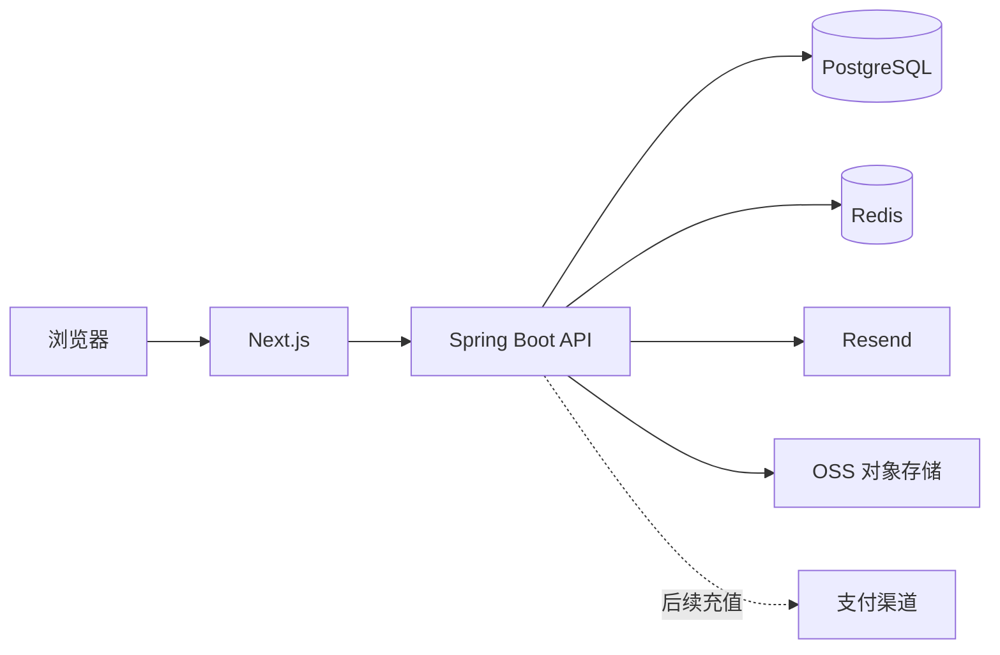

# AriesHub 项目文档

版本：v0.7

日期：2026-10-07

状态：已完成新版公开站、渐进式注册登录和成员区前端；后端已具备身份、Publication 内容目录、Redis 会话、可插拔评论线程（分页、点赞、审核）及简化后的积分数据结构。积分应用 API 与前端接入继续实现。

## 1. 产品定位

AriesHub 是一个围绕 AI 实践内容持续生长的社区。主理人发布原创实战案例、文章和课程，成员可以阅读、收藏、记录进度，并围绕具体内容提问、回复和分享复现结果。

平台不把所有内容统称为「案例库」，也不把首页做成商品列表：

- 公开首页介绍社区主张、内容方向和真实预览；
- 登录成员先进入社区首页，看到继续阅读、已解锁内容、推荐和讨论；
- 完整内容以积分解锁，人民币等法币只在以后用于充值积分；
- 早期主要发布者是主理人，评论与回复向成员开放。

不提供接码、账号交易或未经授权的数字资源，不承诺购买内容必然获得收入或结果。

## 2. 角色

| 角色 | 能力 |
| --- | --- |
| 访客 | 了解社区，浏览公开标题、摘要、免费预览、积分价格和公开讨论 |
| 成员 | 评论、回复、收藏、点赞、记录进度，查看自己的积分与权益 |
| 权益持有人 | 阅读对应完整内容和后续允许访问的资源 |
| 管理员 | 发布内容、管理评论、发放或调整积分、处理权益和运营异常 |

拥有内容是用户与单个内容目标之间的权益关系，不是全局 VIP 角色。

## 3. 内容与社区模型

公开内容统一称为 `Publication`，类型包括：

| 类型 | 含义 |
| --- | --- |
| `CASE_STUDY` | 带过程、关键判断和结果的实战案例 |
| `ARTICLE` | 观点、方法和短篇分享 |
| `COURSE` | 按章节组织并具有清晰学习路径的内容 |

每份内容使用数据库 ID 作为稳定详情地址，需要标题、摘要、分类、封面、作者、发布状态、免费预览与完整章节。内容价格（整数积分）是发布内容自身的属性，存在 `publications.credit_price`；余额和解锁记录属于用户侧，不放进内容聚合。

评论是独立 `discussion` 模块，通过 `target_type + target_key` 挂载内容，接入新的可评论对象只需新增一个目标解析器。**回复是单层的**：根评论独立分页，每条带回复总数与前两条预览，点击后再分页拉取全部回复；回复一条回复时仍挂在同一个根评论下，用 `parent_id` 显示「回复 @某人」。根评论支持「最新 / 热门 / 综合」三种排序，点赞数反规范化在评论行上以便在分页前排序。详细规则见 [社区、积分与内容模型决策](COMMUNITY_DOMAIN_MODEL.md)。

## 4. 积分与支付

内容使用整数积分定价。余额保存在 `users.credit_balance`，扣减是一条带余额校验的原子 UPDATE；所有变动必须写入只追加的 `credit_ledger_entries` 并使用幂等键。成员用积分解锁内容后，在 `content_unlocks` 留下按内容主键挂载的解锁记录。

支付推迟到积分体系稳定之后。未来支付流程为：

```text
法币支付 → 支付渠道确认 → 增加积分流水 → 成员自行用积分解锁内容
```

支付成功本身不直接写内容权益，内容解锁也不直接调用支付渠道。这让赠送积分、运营奖励、退款和不同支付方式可以共用一套积分与权益规则。

## 5. 页面结构

| 页面 | 路径 | 主要内容 |
| --- | --- | --- |
| 公开首页 | `/` | 社区主张、动态视觉、内容方向、精选预览、讨论和加入入口 |
| 登录 / 注册 | `/login`、`/register` | 密码登录；邮箱验证码渐进式注册 |
| 成员首页 | `/home` | 继续阅读、已解锁内容、推荐、最新发布和社区动态 |
| 探索 | `/discover` | 按类型、分类和关键词发现内容 |
| 内容详情 | `/publications/[id]` | 摘要、目录、免费章节、积分报价和讨论 |
| 阅读器 | `/learn/[slug]` | 章节、正文、阅读进度、评论入口 |
| 讨论 | `/community` | 围绕内容的提问、回复、复现和反馈 |
| 我的空间 | `/my-content` | 收藏、点赞、阅读记录、积分与权益 |
| 账号 | `/account` | 通过右上角用户菜单进入；头像、昵称、个性签名与账号信息 |
| 运营后台 | `/admin` | 工作台、内容管理、成员管理、评论审核、数据分析和积分流水 |

内容页面和 API 统一使用 `/publications`，不保留 `/cases` 双写路由。

## 6. 已实现能力

- Next.js 公开首页、登录、注册及成员区完整视觉原型；
- GSAP 滚动、进入、漂浮和渐进式注册动画，支持减少动态效果；
- shadcn/Base UI 控件与 Tailwind CSS；
- PostgreSQL、Flyway、MyBatis-Plus 和模块化单体；
- 注册邮箱验证码、密码登录、退出和当前用户；
- OSS 私有文件上传、当前用户头像绑定与临时展示；昵称和个性签名持久化、独立账号设置页与用户快捷菜单；
- Redis 验证码、登录/注册限流和 Sa-Token 登录态；
- 管理员富文本创作、Markdown 源码切换、阅读预览、草稿自动保存、封面、正文图片/视频/附件、创建/编辑/发布/下架；
- 后台成员搜索与分页、停用/恢复（停用立即撤销会话）、跨线程审核及真实数据工作台/积分流水；
- 内容支持案例、学习文章、课程及免费/积分定价、运营精选；素材按封面/预览/正文分别授权；
- 公开内容查询及免费正文保护；
- 可复用评论线程、根评论分页、单层回复、点赞与目标存在性校验；
- 评论的作者自删、管理员隐藏与锁帖；
- 用户积分余额、只追加流水、内容价格和内容解锁的数据约束。

前端收藏、点赞和阅读进度目前仍是体验数据，接入后端后才能作为跨设备事实。

## 7. 技术边界



- Java 是账号、会话、内容状态、评论、积分和权益的业务事实来源；
- Next.js 不签发 JWT，不把认证 token 写入 localStorage；
- 浏览器使用同域 HttpOnly Cookie，Sa-Token 登录态存入 Redis；
- PostgreSQL 保存持久业务事实，Redis 不替代用户和积分数据库；
- 完整正文只能在 Java 验证权益后返回，不能先发送到浏览器再隐藏；
- 支付回调以后必须验签并以渠道事件幂等，不能由前端声明成功。

## 8. 模块

| 模块 | 职责 |
| --- | --- |
| `identity` | 用户、邮箱、密码、登录态和角色 |
| `storage` | 私有文件上传、文件归属验证与临时签名 |
| `catalog` | Publication 内容聚合（含积分价格）、公开查询与后台编辑 |
| `discussion` | 全局评论线程、根评论分页、单层回复、点赞与审核规则 |
| `operations` | 后台跨表只读统计、近七日趋势和积分流水投影，不执行积分变更 |
| `credit` | 下一阶段实现余额操作、流水与内容解锁（表已就位） |
| `composition` | 跨模块端口适配，不放业务规则 |
| `shared` | 错误契约、请求追踪、审计和健康检查 |

业务模块不相互导入。跨模块读取通过端口与 `composition` 适配，详细规则见 [后端架构](BACKEND_ARCHITECTURE.md)。

## 9. 近期里程碑

后台与创作工作台已接入真实服务，详见 [运营后台与内容创作](ADMIN_WORKSPACE.md)。后续优先接入内容阅读、评论和积分解锁，再推进推荐、聊天与支付。头像、昵称和个性签名编辑已接入后端；密码修改、邮箱变更及公开成员资料仍需后续独立设计。

### M1：Publication 内容迁移（已完成）

- 将旧案例聚合与表一次迁移为 `Publication/publications/publication_contents`；
- 同步 REST 路径、OpenAPI、后台、前端类型和测试；
- 支持实战案例、文章和课程，不保留长期双写。

### M2：评论真实接入

- 前端讨论、文章详情和阅读器调用评论 API；
- 加载、空状态、登录提示、根评论分页与「展开全部回复」交互完整；
- 后端已具备作者自删、管理员隐藏与锁帖；前端接入审核入口。

### M3：积分解锁

- 建立 credit 应用模块和事务服务；
- 管理员发放积分、成员查询余额与流水；
- 积分报价、幂等扣减、权益创建和完整正文授权；
- 我的空间展示积分和已解锁内容。

### M4：内容关系与阅读状态（已完成）

- 收藏、文章点赞和免费正文阅读进度写入 PostgreSQL，支持当前账号分页读取；
- 内容卡片与详情采用真实互动状态，正文版本变更时保护继续阅读位置；
- 社区动态、公开成员资料与通知仍需真实事件模型，目前首页活动组件明确标为示例。

### M5：充值支付

- 积分套餐、充值单、支付尝试和支付事件；
- 渠道验签、幂等回调、查单补偿和退款规则；
- 支付只增加积分，不绕过积分流水直接授予内容。

## 10. 验证

后端执行 `cd backend && ./mvnw clean test`，集成测试使用 Testcontainers 的 PostgreSQL 与 Redis。前端执行格式检查、lint、类型检查、构建和 Playwright。数据库变更只通过 Flyway，生产禁止应用自动修改表结构。

当前视觉与交互标准见 [前端设计语言](FRONTEND_DESIGN_LANGUAGE.md)，外部素材来源见 [素材来源](ASSET_SOURCES.md)。

## 11. 主页面真实数据接入盘点（2026-10-07）

本次补充 8 篇可发布的原创练习内容（3 个案例、3 篇学习文章、2 个课程），发布 ID 为 4–11；6 篇免费，2 个积分课程，3 篇精选。每篇都有 OSS 封面和正文流程图，共 16 个素材对象。内容源、配图、发布结果在 `backend/scripts/community-content.json`、`community-assets/` 和 `community-content-published.json`。它们是当前本地开发数据库的联调内容，不冒充真实用户案例或客户成果；其他环境需重新上传和发布，不能直接复用这些数据库 ID。

### 已接入主页面的真实能力

公开首页 `/` 的内容展示、成员首页 `/home`、探索 `/discover` 与我的空间 `/my-content` 已接入 PostgreSQL 发布内容，不再读取 `conceptPublications`。文章卡片使用 ID 链接、真实内容形式和分类；列表批量补齐封面签名与当前用户状态，不返回私有正文。

| 接口 | 已实现行为 |
| --- | --- |
| `GET /api/v1/publications/cards` | 分页、关键词、分类、形式、阅读方式、精选过滤；`sort=LATEST/FEATURED`；批量封面签名、真实点赞数、当前用户收藏/点赞/阅读位置 |
| `GET /api/v1/home` | 必须登录；分类、最多 4 个精选、6 个最新和 3 个继续阅读条目；缺失历史返回空数组 |
| `PUT/DELETE /api/v1/publications/{id}/bookmark` | 按当前账号幂等增删；重复请求不增加记录 |
| `PUT/DELETE /api/v1/publications/{id}/like` | 文章点赞独立于评论点赞；返回真实计数及当前账号状态 |
| `GET /api/v1/publications/{id}/interaction` | 匿名可查看公开点赞数，个人状态为 false；登录后返回当前账号状态 |
| `GET/PUT /api/v1/publications/{id}/reading-progress` | 免费正文的版本、标题锚点、百分比和更新时间；未阅读返回 null，旧版本保存返回 409；积分预览不可保存为完整阅读 |
| `GET /api/v1/users/me/library?kind=BOOKMARK/LIKE/HISTORY` | 当前账号分页列表；过滤下架、删除或分类已删除的内容；历史额外过滤积分内容 |

收藏与点赞存在数据库唯一约束；写操作在事务中锁定文章行，再通过 MyBatis-Plus 操作关系。账号从服务端会话获取，不能由客户端指定 userId。继续阅读按标题生成稳定锚点，滚动停止 1.5 秒后保存；同版可恢复，正文版本变化时提示从新版开始，失败不会显示保存成功。旧原型 localStorage 状态不会自动冒充真实收藏或解锁权益。

### 社区首页与展示组件

按用户确认的方向，首页保留饱满的社区布局，而非只有文章列表：阅读大卡、三项社区速览、主理人精选、最新发布，以及评论/回复/新文章动态、成员推荐、热门讨论、每周提问和实践邀请。文章、主题数量、收藏、点赞与阅读记录走真实接口；尚无接口的成员和动态使用独立 Mock 数据，分别标注“成员示例”“动态示例”“讨论示例”“互动示例”。动态支持筛选，提问框仅预览当前页面的回答，不声称已发布。

页面底色、分隔线和通用控件保持中性；头像使用原创彩色矢量人物，组件标题、动态类型、主题标签与互动选中态采用低饱和蓝、紫、绿与玫瑰色。黑白极简不意味着把人物、图片和小组件全部转成灰阶。未登录仍受成员页面守卫限制。

### 接下来需要开发的能力

| 优先级 | 能力 | 当前边界与约束 |
| --- | --- | --- |
| P0 | 文章评论真实接入 | 既有讨论 API 已有分页、回复、评论点赞与审核；PUBLICATION 目标仍按 slug 验证，需要迁移到 ID 并合并历史线程后接入 ID 详情 |
| P1 | 社区活动聚合与公开成员资料 | 用实际发布、评论和回复事件替换首页 Mock；不将头像展示推断为实时在线，不公开成员邮箱等私有字段 |
| P1 | 积分解锁与权益 | 余额、幂等扣款、只追加流水、权益和正文/媒体授权需完整事务；当前 CREDIT 仅公开预览，不扣积分 |
| P2 | 通知、关注、私聊、算法推荐 | 需要独立事件、关系和消息模型；当前通知按钮仍禁用，首版精选为运营精选 |
| P2 | 课程章节与课时进度 | 目前 COURSE 是结构化长文；不能用数组索引虚构章节或章节解锁 |

### 验收

后端新增真实 PostgreSQL/Redis 集成测试覆盖重复操作、8 个并发同账号点赞、跨账号隔离、下架过滤、版本冲突、匿名守卫与付费正文保护。前端覆盖真实接口契约下的收藏/点赞、刷新保留、继续阅读、失败重试、URL 筛选与社区组件交互。桌面、平板和手机使用实际已发布卡片与 OSS 图片检查布局及横向溢出；Mock 个人会话与社区展示数据不能代替后端授权测试。
