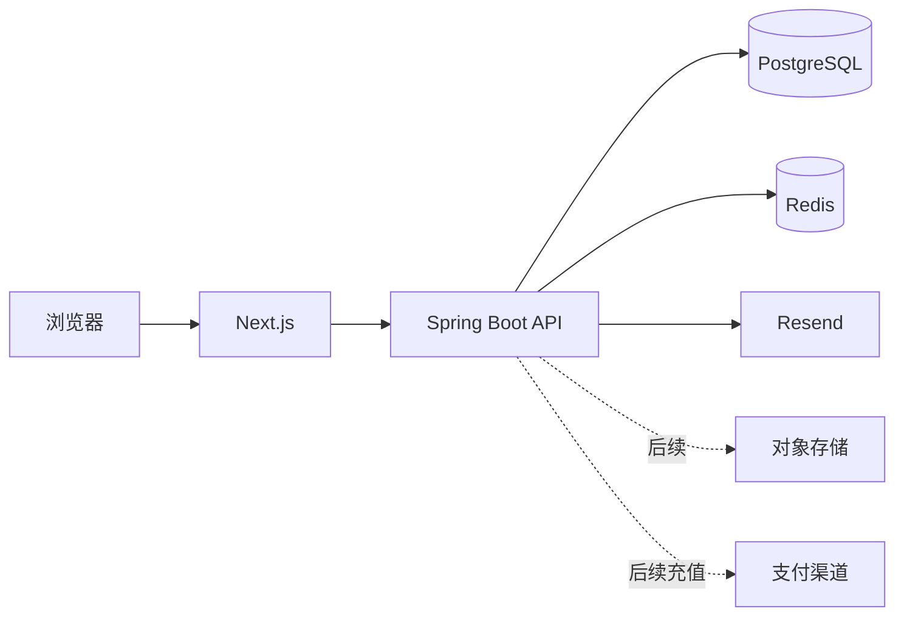

# AriesHub 项目文档

版本：v0.6

日期：2026-09-29

状态：已完成新版公开站、渐进式注册登录和成员区前端；后端已具备身份、内容目录、Redis 会话及全局评论树基础。内容模型与积分权益继续重构。

## 1. 产品定位

AriesHub 是一个围绕 AI 实践内容持续生长的社区。主理人发布原创实战案例、文章和课程，成员可以阅读、收藏、记录进度，并围绕具体内容提问、回复和分享复现结果。

平台不把所有内容统称为「案例库」，也不把首页做成商品列表：

- 公开首页介绍社区主张、内容方向和真实预览；
- 登录成员先进入社区首页，看到继续阅读、已解锁内容、推荐和讨论；
- 完整内容以积分解锁，人民币等法币只在以后用于充值积分；
- 早期主要发布者是主理人，评论与回复向成员开放。

不提供接码、账号交易或未经授权的数字资源，不承诺购买内容必然获得收入或结果。

## 2. 角色

| 角色 | 能力 |
| --- | --- |
| 访客 | 了解社区，浏览公开标题、摘要、免费预览、积分价格和公开讨论 |
| 成员 | 评论、回复、收藏、点赞、记录进度，查看自己的积分与权益 |
| 权益持有人 | 阅读对应完整内容和后续允许访问的资源 |
| 管理员 | 发布内容、管理评论、发放或调整积分、处理权益和运营异常 |

拥有内容是用户与单个内容目标之间的权益关系，不是全局 VIP 角色。

## 3. 内容与社区模型

公开内容统一称为 `Publication`，类型包括：

| 类型 | 含义 |
| --- | --- |
| `CASE_STUDY` | 带过程、关键判断和结果的实战案例 |
| `ARTICLE` | 观点、方法和短篇分享 |
| `COURSE` | 按章节组织并具有清晰学习路径的内容 |

每份内容需要稳定 slug、标题、摘要、分类、封面、作者、发布状态、免费预览与完整章节。积分报价和权益属于独立模块，不放进内容聚合。

评论是独立 `discussion` 模块，通过 `target_type + target_key` 挂载内容。成员既可以评论内容，也可以回复任意评论；服务端保存父节点、根节点和深度，返回树形数据。详细规则见 [社区、积分与内容模型决策](COMMUNITY_DOMAIN_MODEL.md)。

## 4. 积分与支付

内容使用整数积分定价。积分账户保存可用余额，所有变动必须写入不可变流水并使用幂等键。成员用积分解锁内容后取得独立权益。

支付推迟到积分体系稳定之后。未来支付流程为：

```text
法币支付 → 支付渠道确认 → 增加积分流水 → 成员自行用积分解锁内容
```

支付成功本身不直接写内容权益，内容解锁也不直接调用支付渠道。这让赠送积分、运营奖励、退款和不同支付方式可以共用一套积分与权益规则。

## 5. 页面结构

| 页面 | 路径 | 主要内容 |
| --- | --- | --- |
| 公开首页 | `/` | 社区主张、动态视觉、内容方向、精选预览、讨论和加入入口 |
| 登录 / 注册 | `/login`、`/register` | 密码登录；邮箱验证码渐进式注册 |
| 成员首页 | `/home` | 继续阅读、已解锁内容、推荐、最新发布和社区动态 |
| 探索 | `/discover` | 按类型、分类和关键词发现内容 |
| 内容详情 | `/cases/[slug]`，迁移后 `/publications/[slug]` | 摘要、目录、免费章节、积分报价和讨论 |
| 阅读器 | `/learn/[slug]` | 章节、正文、阅读进度、评论入口 |
| 讨论 | `/community` | 围绕内容的提问、回复、复现和反馈 |
| 我的空间 | `/my-content` | 收藏、点赞、阅读记录、积分与权益 |
| 账号 | `/account` | 用户资料、登录与安全 |
| 内容后台 | `/admin` | 草稿、编辑、发布、下架和资源管理 |

旧 `/cases` 路由在内容模型迁移期间继续工作。新的页面和接口不继续扩散 `case` 命名。

## 6. 已实现能力

- Next.js 公开首页、登录、注册及成员区完整视觉原型；
- GSAP 滚动、进入、漂浮和渐进式注册动画，支持减少动态效果；
- shadcn/Base UI 控件与 Tailwind CSS；
- PostgreSQL、Flyway、MyBatis-Plus 和模块化单体；
- 注册邮箱验证码、密码登录、退出和当前用户；
- Redis 验证码、登录/注册限流和 Sa-Token 登录态；
- 管理员内容创建、编辑、发布和下架；
- 公开内容查询及免费正文保护；
- 可复用评论线程、根评论、树状回复及目标存在性校验；
- 积分账户、只追加流水、积分报价和内容权益的数据约束。

前端收藏、点赞和阅读进度目前仍是体验数据，接入后端后才能作为跨设备事实。

## 7. 技术边界



- Java 是账号、会话、内容状态、评论、积分和权益的业务事实来源；
- Next.js 不签发 JWT，不把认证 token 写入 localStorage；
- 浏览器使用同域 HttpOnly Cookie，Sa-Token 登录态存入 Redis；
- PostgreSQL 保存持久业务事实，Redis 不替代用户和积分数据库；
- 完整正文只能在 Java 验证权益后返回，不能先发送到浏览器再隐藏；
- 支付回调以后必须验签并以渠道事件幂等，不能由前端声明成功。

## 8. 模块

| 模块 | 职责 |
| --- | --- |
| `identity` | 用户、邮箱、密码、登录态和角色 |
| `catalog` | 当前旧内容目录；下一阶段迁移为 publication 语义 |
| `discussion` | 全局评论线程、评论树和回复规则 |
| `credit` | 下一阶段实现账户、流水、积分操作和报价 |
| `entitlement` | 下一阶段实现内容访问授权 |
| `composition` | 跨模块端口适配，不放业务规则 |
| `shared` | 错误契约、请求追踪、审计和健康检查 |

业务模块不相互导入。跨模块读取通过端口与 `composition` 适配，详细规则见 [后端架构](BACKEND_ARCHITECTURE.md)。

## 9. 近期里程碑

### M1：Publication 内容迁移

- 将 `CaseStudy/cases/case_contents` 一次迁移为通用内容与章节；
- 同步 REST 路径、OpenAPI、后台、前端类型和测试；
- 支持实战案例、文章和课程，不保留长期双写。

### M2：评论真实接入

- 前端讨论、文章详情和阅读器调用评论树 API；
- 加载、空状态、登录提示、回复和最大层级提示完整；
- 增加编辑、软删除、隐藏和管理员审核能力。

### M3：积分解锁

- 建立 credit 应用模块和事务服务；
- 管理员发放积分、成员查询余额与流水；
- 积分报价、幂等扣减、权益创建和完整正文授权；
- 我的空间展示积分和已解锁内容。

### M4：社区状态

- 收藏、点赞和阅读进度写入 PostgreSQL；
- 内容详情显示真实统计，不使用虚构数字；
- 通知只在真实事件模型完成后开放。

### M5：充值支付

- 积分套餐、充值单、支付尝试和支付事件；
- 渠道验签、幂等回调、查单补偿和退款规则；
- 支付只增加积分，不绕过积分流水直接授予内容。

## 10. 验证

后端执行 `cd backend && ./mvnw clean test`，集成测试使用 Testcontainers 的 PostgreSQL 与 Redis。前端执行格式检查、lint、类型检查、构建和 Playwright。数据库变更只通过 Flyway，生产禁止应用自动修改表结构。

当前视觉与交互标准见 [前端设计语言](FRONTEND_DESIGN_LANGUAGE.md)，外部素材来源见 [素材来源](ASSET_SOURCES.md)。
